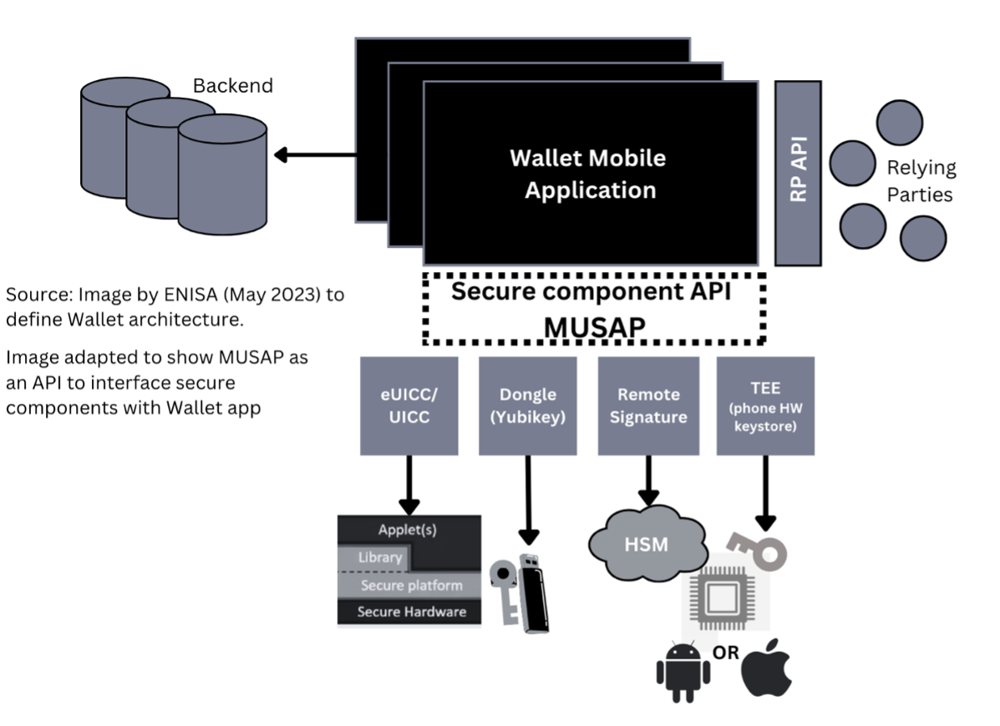
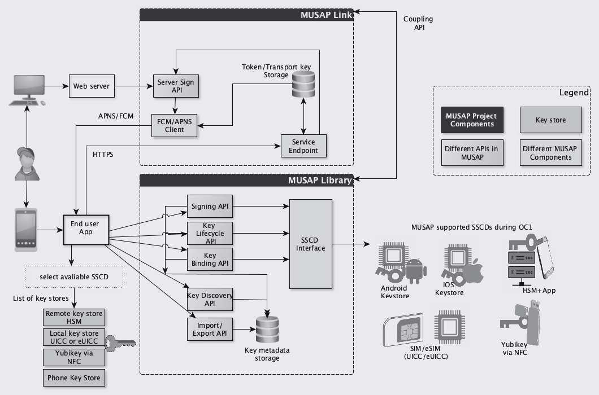
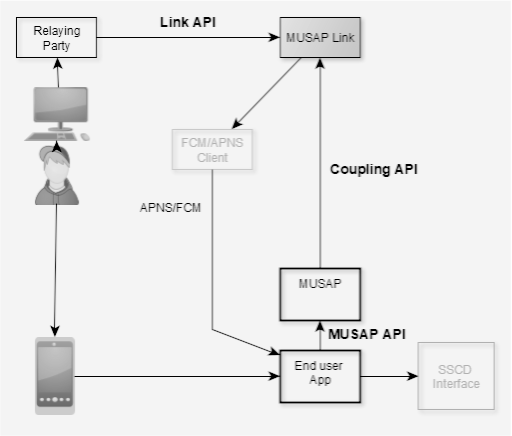
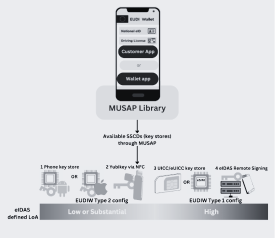

# MUSAP Project

"MUSAP: "Multiple SSCD with Unified Signature API Library" aims to develop a new software interface called Unified Signature Application Programming Interface (USAPI) Library. MUSAP will act as an intermediary layer that abstracts the complexities of different SSCD technologies and provides a unified API Library for developers. 

## 1. About MUSAP 
During OC1 of NGI Trustchain project, 4 key stores will be enabled for the end-user with MUSAP, i.e TEE (Android Key store or iOS Secure Enclave), eUICC/UCICC (Mobile ID), Dongle (Yubikey via NFC) and eIDAS Remote Signing.  As EDIW progressed, ENISA (European Cybersecurity Agency) has been releasing recommendations related to a need for harmonized interface that allows access to cryptographic operations. Image below incorporates MUSAP scope to act as a secure component API to enable SSCD for end-user. 

MUSAP Library (Java/Swift) can be integrated with any Android or iOS app projects. Whereas, MUSAP Link Library (Servlet component) is delivered as a library that can be used with a Java-based web server.

## a. Project Motivation
The primary objective of the MUSAP project has been three fold: 
1. To develop an open-source API library that streamlines the integration of various Secure Signature Creation Devices (SSCDs) into smartphone applications, thereby facilitating the creation of robust authentication and signature solutions. 
2. MUSAP aims to seamlessly integrate with both centralized and decentralized identity management systems, allowing SSCD keys to function effectively in both environments. This approach empowers end-users to access services without being constrained by the specific identity management model in use. 
3. To allow support for multiple certificates/credentials in one device. This approach demonstrates MUSAP’s user-centric approach, where giving option to choose which SSCD they want to have their private keys in, and allows end-users to have identities with various level of assurances in use."

## b. Use Case description 
Explained in Section 3C of this file. 

## c. Essential Functionalities 
MUSAP has 10 defined functionalities (as mentioned in D1 and D2). These functionalities are listed below:
1. F1 i.e., Functionality 1 Integration of multiple SSCDs into MUSAP library
2. F2 i.e., Functionality 2 Open Interface for integrating new & multiple SSCDs with APP
3. F3 i.e., Functionality 3 Digital Signatures with different LoAs (High, Substantial)
4. F4 i.e., Functionality 4 Key discovery
5. F5 i.e., Functionality 5: Key lifecycle management (do defined key operations)
6. F6 i.e., Functionality 6: Key Attestation
7. F7 i.e., Functionality 7: Key metadata definition and import/export
8. F8 i.e., Functionality 8: Sign data and cryptographic formats
9. F9 i.e., Functionality 9: MUSAP Link library (Servlet component)
10. F10 i.e., Functionality 10: URI Scheme

    
## d. How MUSAP can be integrated
MUSAP architecture supports both smartphone based apps (iOS or Android) and web servers (remote web wallets). Smartphone support is defined in Module 1 i.e.  [MUSAP Android Library](https://github.com/methics/musap-android) or [MUSAP iOS Library](https://github.com/methics/musap-ios)  and web server support is defined in module 2 i.e. [MUSAP Link Library (java) ](https://github.com/methics/musap-link) 

## e. Gaps Addressed
According to our research and information there are no publicly known/available APIs for smartphone app developers to connect SSCD functionalities in app and offer multiple types of SSCDs in one device. The following table describes these challenges and how MUSAP tries to solve them.

| State of the Art                                            | What MUSAP provides?                                         |
|------------------------------------------------------------|---------------------------------------------------------------|
| Identifying key is platform specific                       | Universal key identification                                  |
| Selecting correct key is platform specific                 | Universal key selection                                       |
| Confirming the authenticity of a key (verify SSCD )        | Key attestation or certificate                                |
| Set of cryptographic algorithms are platform specific      | We try to unify when applicable                               |
| Typically one device provides one type of LoA signature    | LoA selection mechanism. Allows the user to select LoA        |
| DIDs and VCs are not signed with centralized technologies  | Define DID signing mechanism                                  |
| Server-side web wallets require additional component       | MUSAP Link server connects smartphone apps to Web Wallets     |

## f. Expected benefits from MUSAP

MUSAP, developed during Trustchain NGI OC1, will provide a holistic approach for the NGI community and the Digital Identity landscape to leverage MUSAP for their use. It will provide:

1. Enhancing User-Centric Decentralized Identity Solutions:
   - MUSAP does not interact with blockchain but provides mechanisms to sign. It also provides:
     - Improved interoperability: The proposed solution aims to ensure that identities issued will be interoperable across the EU. This means that different identities can be verified and authenticated by other providers, improving the overall interoperability of digital identities.
     - Improved Usability

2. Bridge between Centralized and Decentralized identities:
   - Identity services for citizens may use centralized or decentralized identities. Enrolling new identities or Verifiable Credentials (VCs) are independent of the SSCD technology.

3. Enhanced security:
   - The proposed solution will provide robust authentication and verification mechanisms, along with strong security measures, to protect the exchange and storage of data. This will ensure that users' private keys are kept secure and that their sensitive information is protected.

4. Improved user control and privacy:
   - The project will allow users to have multiple digital identities with different levels of assurance for different use cases. This will give users more control over their online presence and enable them to manage their privacy and security more effectively. Users have the flexibility to define their private keys.

## g. Demonstration Scenario

Methics' focus during the MUSAP project has been to let end-users choose which Secure Software and Communications Device (SSCD) technology they trust more. If they trust one SSCD more than the other, they should have the option to use it.

To demonstrate MUSAP, Methics has a threefold approach:
1. Methics demonstrates the complete functionality of MUSAP using a demo/test app and SSCDs provided by Methics' products.
2. Methics shares the complete MUSAP library with the Danubetech team to use in their operations. The Danubetech team uses MUSAP to sign Decentralized Identifiers (DIDs) in the Client-DID project (a two-way collaboration in OC1).
3. Methics demonstrates MUSAP functionality in production systems in Mongolia, where users can select from available SSCDs to sign documents on a document signing service called VSign.

# 2. MUSAP Repositories 
Following software code is developed so far:
1.	[MUSAP API Specification]: Informative repository documenting MUSAP API specifications
2.	[MUSAP Android Library](https://github.com/methics/musap-android): Repository about MUSAP Android library 
3.	[MUSAP iOS Library](https://github.com/methics/musap-ios): Repository about MUSAP iOS library
4.	[MUSAP Link Library (java) ](https://github.com/methics/musap-link): Repository about component of MUSAP deployed on backend (server)
5.	[Android Reference app for MUSAP ](https://github.com/methics/musap-demo-android): Reference Demo app for Android using MUSAP Android Library 
6.	[iOS Reference app for MUSAP ](https://github.com/methics/MUSAP-Demo-App-iOS):  Reference Demo app for iOS using MUSAP iOS Library
7.	[Divvy app for Client-DIDs project (Danubetech)]:Divvy app for Danubetech demo using MUSAP Android Library
8.	[VSign Android App API]: Sign App for vsign.mn Pilot using MUSAP Android Library to call Unitel mPKI SIM and GSign App 

Image below provides high level overview of MUSAP architecture.

Overall MUSAP project will provide three distinct APIs: 
1. MUSAP API (Native Android or iOS)
2. MUSAP Link API (REST): API for Relying Parties to request signature through MUSAP
3. MUSAP Coupling API (JSON): To link MUSAP Library and MUSAP Link

   
Image below illustrates MUSAP scope, which highlights all above-mentioned APIs. 

# 3. More Details

## a. Customer Engagement
By developing standards and sharing information on SSCD constraints and security, we make eID more secure, affordable, and enable a long-term evolution path for customers.

MUSAP enables the end-user to have multiple identities of different Levels of Assurance (LoAs). This makes it possible for the user to adapt both centralized and decentralized identities, select preferred SSCD technology, LoA level, and use the solution which is best for each use-case.

## b. Monetisation 
TBD

## c. MUSAP Use Cases
Overall MUSAP project will provide three distinct APIs: 
1. Enable Type 1 (High) and Type 2 (Substantial) configurations of EUDIW in one device
2.	Sign any data format (X.509, VC, DID, etc.)
3.	Provide multiple keystores/sscds to end-user to sign/auth
4.	Handling Key Management methods and operations

Image below illustrates MUSAP uaw case for EUDIW 

MUSAP fact sheet can be found here: 
[MUSAP fact sheet](https://www.methics.fi/wp-content/uploads/2023/11/MUSAP_Product_Fact_Sheet.pdf)

# 4. Trustchain Partners that support scenarios

Danubetech (Client-DID) 

# 5. Human Centric approach 
For the validation of MUSAP concept and to comply with user-centric approach meeting with many potential partners is carried out during OC1.
Based on initial feedback from potential users (Current Methics customer businesses, end-user survey in Mongolia), MUSAP scope has been adjusted to comply with user needs.

 # 6. Team
MUSAP Team can be viewed on NGI Trustchain's MSUAP page.  [MUSAP Team ](https://trustchain.ngi.eu/musap/)

 # 7. About MUSAP and Methics
MUSAP Project has received funding from the NGI TrustChain project. Project is funded under the NGI initiative by the European Union (GA No 101093274). MUSAP is  released as an Open-Source Library in Github. 

Methics is a Finnish technology vendor specializing in Digital Identity and Mobile Signatures services. Methics specializes in delivering standards based identity solutions. 
For more info visit [MUSAP website](https://methics.fi/musap)
